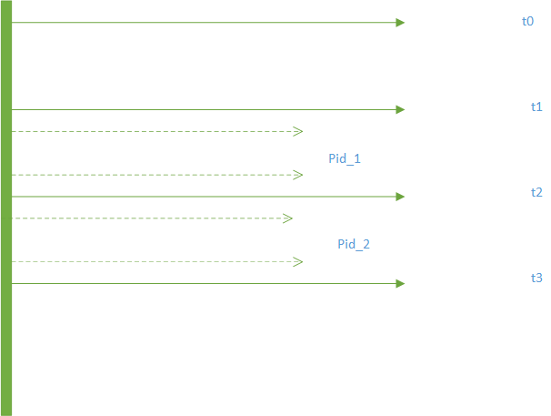

# 系统监控模块
## 概述
系统监控模块用于对片上linux系统资源监控，基于proc文件系统实现对CPU和内存资源的监控，并记录日志
到本地，监控分为两大部分进行，
1） 对整个片上资源的监控，包括

|系统级监控|
|----|
|CPU占用率|
|用户态CPU占用率|
|内核态CPU占用率|
|内存占用率|
|buff空间大小|
|cache空间大小|
2） 对所设置的进程（程序）进行资源消耗的监控,包括

|进程级监控|
|----|
|进程CPU占用率|
|进程用户态CPU占用率|
|进程内核态CPU占用率|
|进程内存使用率|

对系统级的监控是伴随着程序的启动进行的，对进程级的监控进程名字通过传参进行配置，如无则不进行监控，
监控的时间间隔采用程序传参进行配置，同时，可以通过传参配置选择监控结果为实时显示还是记录日志，日
志记录系统基于zlog进行管理，代码以c进行开发，实现更加快速，轻量化的监控

监控处理程序关注的是一种“态势”



如上图示，为监控两个进程是示图，则
pid_1的cpu及内存的占用率对应的总值为t1-t2
pid_2的cpu及内存的占用率对应的总值为t2-t3

而这一次的系统级的监控则为
t0-t1 t1-t2 t2-t3的三次平均的结果，


```bash
smm_v1.0 
         
 Usage   :         
    smm [options] -t <Monitoring period> -p {[app_name1]:[name2]:..}        
    options        
        -h,--help                          get app help        
        -d,--display                       display monitoring results        
        -l,--log                           record monitoring results use zlog 
```
```
eg:
sudo ./smm -d -t 1000 -p sshd:stress:test
%CPU(s)  44.78% use 37.41% usr  4.85% sys  2.52% si 
%MEM(MB) 21.11% use 77.43/509.40 buff/cache 
PID:sshd (15402) 
CPU(s)   0.00% use  0.00% usr  0.00% sys 
MEM  0.19%
PID:stress (31765) 
CPU(s)  25.42% use 25.42% usr  0.00% sys 
MEM 15.03%
PID:test (30461) 
CPU(s)   0.01% use  0.01% usr  0.00% sys 
MEM  0.06%
```

其他：
-t 指定监控的时间间隔
-p 可以指定监控的进程名字，以：进行分割，最多支持128个进程的监控
默认为记录log的模式进行工作，如需实时显示，需-d参数
zlog的形式可以自行更改，默认采用的是常监控记录为smm.info

如下
只要在最上面加上markdown的头就可以转化为表格了
通过下面的网址，可以很方便的转换成多种形式的表格（如 excel）进行数据分析。
https://tableconvert.com
```
|%CPU(s)| 42.27% |use |34.32% |usr | 5.03% |sys | 2.93% |si|%MEM(MB)| 21.13% |use |77.34/492.33 |buff/cache |PID:IV_Fusion (4216)|CPU(s) | 12.71% |use |11.86% |usr | 0.85% |sys |MEM | 1.07%|PID:can_sensorparse (4155)|CPU(s) |  0.00% |use | 0.00% |usr | 0.00% |sys |MEM | 0.19%|PID:stress (25496)|CPU(s) | 23.77% |use |20.49% |usr | 3.28% |sys |MEM |15.03%| 
```
如果某一进程异常退出了，如stress进程退出后会记录为如下，这样做是为了在做图标分析时，”列“是对齐的
```
|%CPU(s)| 17.50% |use |10.46% |usr | 4.78% |sys | 2.26% |si|%MEM(MB)|  5.98% |use |77.33/487.11 |buff/cache |PID:IV_Fusion (4216)|CPU(s) | 11.21% |use | 9.48% |usr | 1.72% |sys |MEM | 1.07%|PID:can_sensorparse (4155)|CPU(s) |  0.83% |use | 0.00% |usr | 0.83% |sys |MEM | 0.19%|PID:stress (x)|CPU(s) |  |use | |usr | |sys |MEM | |
```
当处于监控中的进程退出时会记录smm.notice
如下
```
2020-07-24 13:40:17. 1 NOTICE - pid_name (stress) has dead!! 
2020-07-24 13:40:31. 1 NOTICE - pid_name (stress) has dead!! 
```
记录的日志采用markdown的格式，需要自己添加一个头即可形成表格的形式。
